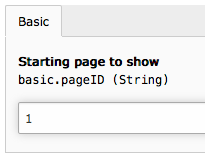
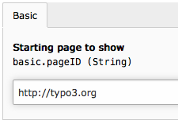
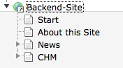
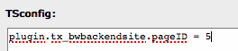

============================
Administrator Manual
============================

Target group: **Administrators**

Installation
=============

After installation you can edit the extension configuration

* pageID: either an integer value for the page id you want to display or a string
  pointing to an URL of your choice. If you choose the same domain as your
  backend login the user can make use of the admin panel and inline editing.

		Page ID as integer

		Page URL as string

* menu: Choose one of 'user', 'tools', 'system' or 'web'. Your module will be
  shown in the section named. In TYPO3 7.6LTS and higher, 'user' will be shown
  as a drop-down menu in the top bar which is not as visible as 'tools' or
  'system'.
  
You may set up a separate page tree just for backend users. Users must have
access to the page, so this page tree must be mounted for them.

		A sample page tree

* locallang: Create locallang.xlf files for each module you want to use. TYPO3
  uses the three entries `mlang_tabs_tab`, `mlang_labels_tablabel` and 
  `mlang_labels_tabdescr` as shown in the Language folder.

* icon: Add a file to be used as icon to the module. Best to use a SVG file.

Make all pages of Doktype "Backend" to exclude the pages from public view.

You may add any Content Element or Plugin to your Backend pages.

Configuration
=======================

Additionally, you may override settings with userTS (may cascade through groups)
for setting a different page to display for each group or user.

		Override in userTS (groupTS)

