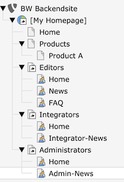

============================
Administrator Manual
============================

Target group: **Administrators**

Installation
=============

After installation you can edit the extension configuration

* pageID: either an integer value for the page id you want to display or a string
  pointing to an URL of your choice. If you choose the same domain as your
  backend login the user can make use of the admin panel and inline editing.

.. figure:: Images/AdministratorManual/extconf-integer.png
		:alt: Integer parameter

		Page ID as integer

.. figure:: Images/AdministratorManual/extconf-url.png
		:alt: String parameter

		Page URL as string

* menu: Choose one of 'user', 'tools', 'system' or 'web'. Your module will be
  shown in the section named. In TYPO3 7.6LTS and higher, 'user' will be shown
  as a drop-down menu in the top bar which is not as visible as 'tools' or
  'system'.
  
You may set up a separate page tree just for backend users. Users must have
access to the page, so this page tree must be mounted for them.

.. figure:: Images/AdministratorManual/backend-site.png
		:alt: Page tree

		A sample page tree

* locallang: Create locallang.xlf files for each module you want to use. TYPO3
  uses the three entries `mlang_tabs_tab`, `mlang_labels_tablabel` and 
  `mlang_labels_tabdescr` as shown in the Language folder.

* icon: Add a file to be used as icon to the module. Best to use a SVG file.

Make all pages of Doktype "Backend" to exclude the pages from public view.

You may add any Content Element or Plugin to your Backend pages.

Configuration
=======================

Additionally, you may override settings with userTS (may cascade through groups)
for setting a different page to display for each group or user.

.. figure:: Images/AdministratorManual/userTS.png
		:alt: User Typoscript override

		Override in userTS (groupTS)

Customization
=============

Starting from version 1.2.0, the extension is using a Fluid template to render
the iFrame element by itself. Now you are able to customize the rendering, e.g.
adding elements to the control bar in the user module like a title, buttons or
shortcuts. Please note that only the start page is rendered this way. All
subsequent pages are rendered in the same frame and can't change contents of the
control bar.

Embedding tools
===============

There are some planning and communication tools that allow you to embed web views
into your pages. This way all of your collegues can keep up-to-date.

Google Docs
-----------

You can easily embed any Google Docs document like texts, spreadsheets and presentations using the standard HTML content element:

.. code-block:  HTML

    <iframe src="https://docs.google.com/document/d/..." style="width:100%;height:800px;border:none"></iframe>

Trello
------

Go to `Trello Boards`_ or `Trello Cards`_ for a method to embed shortcuts to your 
team's Trello boards. While you are not able to embed whole boards you can show
a list of thumbnails representing boards the current user has access to.

Example
=======

For a basic setup you may start by adding the TS template below to the root page of this example page tree:

    A sample page tree with a public homepage and 3 separate backend page trees

.. code-block::  TypoScript

    # Default PAGE object:
    page = PAGE

    # Simple stylesheet
    page.10 = TEXT
    page.10.value (
      
    )

    # Simple local menu
    page.30 = HMENU
    page.30 {
      # adjust this to the entry level of your backend pages
      entryLevel = 1

      # don't exclude backend user pages (type 6) in this case
      excludeDoktypes = 7

      wrap = <nav class="main"><ul>|</ul></nav>
      1 = TMENU
      1 {
        NO = 1
        NO {
          linkWrap = <li>|</li>
        }
        CUR = 1
        CUR {
          linkWrap = <li><strong>|</strong></li>
        }
      }
    }

    # Title bar with title of current page and title of root page of this branch
    page.20 = COA
    page.20 {
      wrap = 
|

      10 = TEXT
      10.wrap = |
      10.insertData = 1
      10.field = title

      20 = TEXT
      20.wrap = |
      20.data = LEVELTITLE:1
    }

    # Page content
    page.50 = CONTENT
    page.50 < styles.content.get

.. _Trello Boards: https://developer.atlassian.com/cloud/trello/guides/embedding/embedding-boards/

.. _Trello Cards: https://developer.atlassian.com/cloud/trello/guides/embedding/embedding-cards/