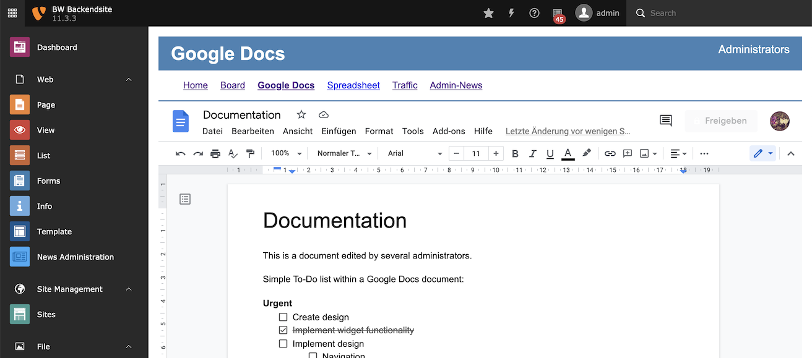
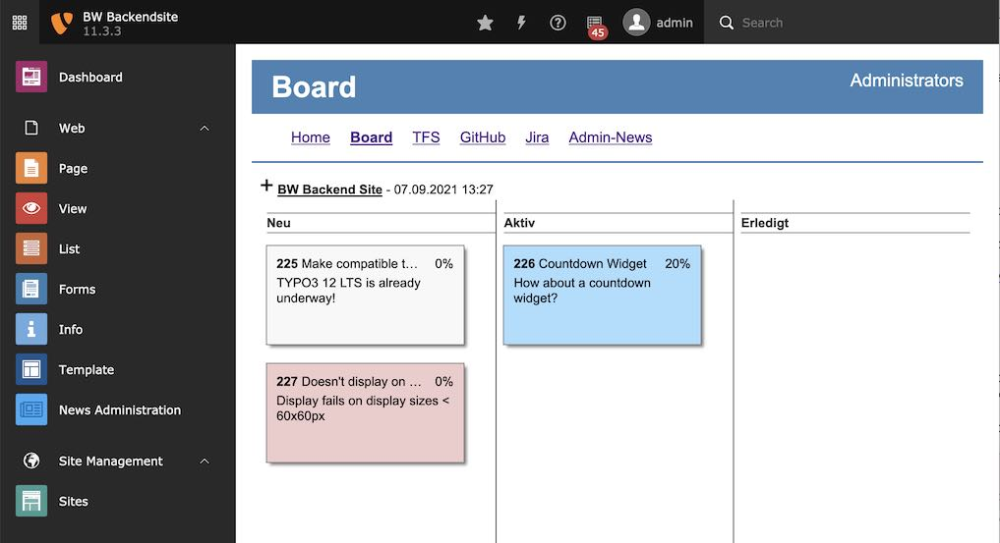
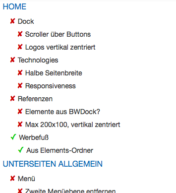

=====================
Project Information
=====================

This is a simple extension that displays a page in the Backend content frame.

I wanted to have a means of giving my editors latest information on the state of
the project, have the Style Guide attached as a download and even have some
Todo app for them to check off work that has been done.

I imagined that all this functionality is already built into TYPO3 or could be
added by extensions, so why not use this power in the Backend as well?

I asked myself what these "Backend" pages are for and mused that they were exactly
created for this type of application.

As an example, imagine you could add help pages for Editors, Integrators and
Administrators right in the CMS these people are working on together. And these 
pages could be edited by the same individuals with the same tools they are
already using. These pages would have their own navigation, could be viewed in 
and outside of the TYPO3 backend and would be interactive and responsive by
nature.

You can use Backend Sites for:

* Documentation
* Collaboration
* On-boarding of new users
* News, announcing planned outages, display of current load etc.
* Embed or link to related systems (phonebook/directory, hosting administration)

		Example of a Google Docs document

		Example of a simple task board

		Example of a simple to-do list page

Releases
-----------

Releases are put into TER as well as published on GitHub under stable_.

Bugs and Known Issues
-----------------------------------

Bugs, issues and feature request can be put into the `Bug Tracker`_ on GitHub.

Pull requests and detailed bug or feature descriptions are welcome.

.. _Bug Tracker: http://github.com/bomeyer/bw_backendsite/issues

To Do
-----------

Upcoming features are usually put on GitHub `roadmap`_ as "enhancements", but generally I
want to add the following plugins to the extension:

.. _roadmap: http://github.com/bomeyer/bw_backendsite/labels/enhancement

Change Log
-----------

It is recommended to provide the User with a URL pointing to a roadmap_. Forge gives the possibility to create a Roadmap very easily. Optionnally, 
the link could point to the `repository log`_.

.. _source code: http://git.typo3.org/
.. _stable versions: http://github.com/bomeyer/releases
.. _repository log: http://github.com/bomeyer/
