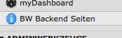

============
Users manual
============

Your administrator has set up the site you will see in the Backendsite menu.

.. figure:: Images/UserManual/user-bw_backendsite.png
		:alt: Backend view

		You find the menu item in your user menu on the page top

		In TYPO3 6.x you find the item in the main menu on the left

