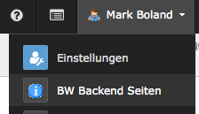

BW Backend Site
===============

View a part of your page tree in the backend.

Add project documentation, news for adminstrators and editors with the TYPO3 tools
you already use.

Highlights: 

* Set a standard page ID or URL for all users
* Override settings with userTS
* Set module group to be added to ('user', 'system', 'tools', 'help' or your own)
* 3 configurable modules for different applications
* Selectable as start modules in user settings

* `github`_ Project page

.. _github: http://github.com/bomeyer/bw_backendsite
